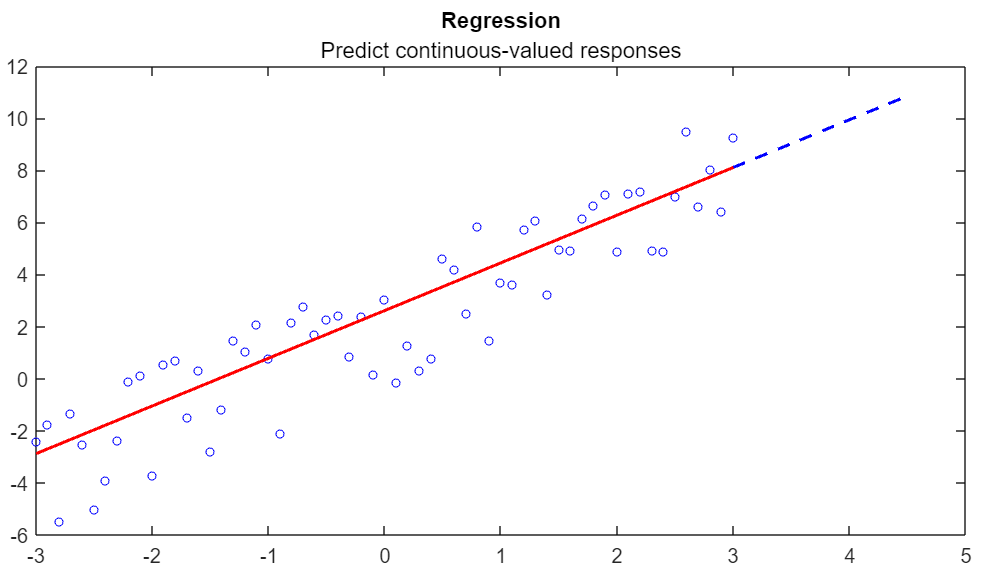
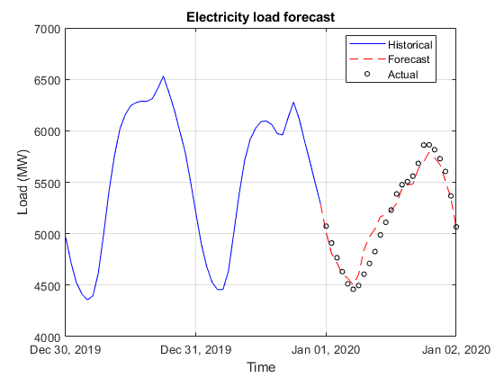
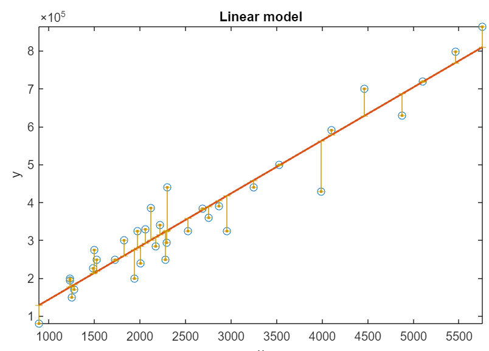

<<<<<<< HEAD

# Machine Learning for Regression

=======
# Machine Learning for Regression  or 
**Curriculum Module**  
_Created with R2021a. Compatible with R2021a and later releases._  
>>>>>>> 5100b76248ef69c8904f90da6cf16b39d53b901a

 or 

**Curriculum Module**

<<<<<<< HEAD
_Created with R2021a. Compatible with R2021a and later releases._

# Information

This curriculum module contains interactive [MATLAB® live scripts](https://www.mathworks.com/products/matlab/live-editor.html) that teach the basics of machine learning for regression.

## Background

You can use these live scripts as demonstrations in lectures, class activities, or interactive assignments outside class. This module covers the difference between regression, classification, and clustering, as well as feature engineering and feature extraction, overfitting and underfitting, and a variety of machine learning models commonly used for regression. It also includes a detailed example of applying regression models for electricity load forecasting using real-world data.

The instructions inside the live scripts will guide you through the exercises and activities. Get started with each live script by running it one section at a time. To stop running the script or a section midway (for example, when an animation is in progress), use the  Stop button in the **RUN** section of the **Live Editor** tab in the MATLAB Toolstrip.

## Contact Us

Solutions are available upon instructor request. Contact the [MathWorks teaching resources team](mailto:onlineteaching@mathworks.com) if you would like to request solutions, provide feedback, or if you have a question.

## Prerequisites

This module does not assume any prior exposure to the subject of machine learning.

## Getting Started
### Accessing the Module
### **On MATLAB Online:**

Use the  link to download the module. You will be prompted to log in or create a MathWorks account. The project will be loaded, and you will see an app with several navigation options to get you started.

### **On Desktop:**

Download or clone this repository. Open MATLAB, navigate to the folder containing these scripts and double-click on [MLforRegression.prj](MLforRegression.prj). It will add the appropriate files to your MATLAB path and open an app that asks you where you would like to start. 

Ensure you have all the required products ([listed below](#H_E850B4FF)) installed. If you need to include a product, add it using the Add-On Explorer. To install an add-on, go to the **Home** tab and select   **Add-Ons** > **Get Add-Ons**. 

## Products

MATLAB® is used throughout. Tools from Statistics and Machine Learning Toolbox™ are used frequently as well.

# Scripts

 *If you are viewing this in a version of MATLAB prior to R2023b, you can view the learning outcomes for each script* [*here*](https://www.mathworks.com/matlabcentral/fileexchange/95903-machine-learning-for-regression)

## [**MachineLearningIntro.mlx**](Scripts/MachineLearningIntro.mlx)
|  | **In this script, students will...**  -  Learn the difference between regression, classification, and clustering  -  Define feature engineering/extraction  -  Identify and use different machine learning models commonly used for regression  -  Be able to explain overfitting and underfitting  |
| :-- | :-- |

## [**LoadForecastRegression.mlx**](Scripts/LoadForecastRegression.mlx)
|  | **In this script, students will...**  -  Apply the machine learning workflow to solve a problem in time series forecasting  -  Engineer appropriate features to solve the forecasting problem  -  Validate and compare different types of regression models  -  Test and evaluate the trained model to make predictions  |
| :-- | :-- |

## [**FE1_ProgrammaticML.mlx**](Scripts/FE1_ProgrammaticML.mlx) **and** [**FE2_LoadForecastDL.mlx**](Scripts/FE2_LoadForecastDL.mlx)
|  | **In these scripts, students will...**  -  Expand on the practical problem presented in [LoadForecastRegression.mlx](Scripts/LoadForecastRegression.mlx)  -  Define feature engineering/extraction  -  Identify and use different machine learning models commonly used for regression  -  Be able to explain overfitting and underfitting  |
| :-- | :-- |

# Related Courseware Modules

## [**Regression Basics**](https://www.mathworks.com/matlabcentral/fileexchange/93435-regression-basics)
|  | **Available on:**[GitHub](https://github.com/MathWorks-Teaching-Resources/Regression-Basics)  |
| :-- | :-- |

## [**Machine Learning Methods: Clustering**](https://www.mathworks.com/matlabcentral/fileexchange/135381-machine-learning-methods-clustering)
|  | **Available on:**[GitHub](https://github.com/MathWorks-Teaching-Resources/Machine-Learning-Methods-Clustering)  |
| :-- | :-- |

Or feel free to explore our other [modular courseware content](https://www.mathworks.com/matlabcentral/fileexchange/?q=tag%3A%22courseware+module%22&sort=downloads_desc_30d).

# Educator Resources
-  [Educator Page](https://www.mathworks.com/academia/educators.html) 

# Contribute 

Looking for more? Find an issue? Have a suggestion? Please contact the [MathWorks teaching resources team](mailto:%20onlineteaching@mathworks.com). If you want to contribute directly to this project, you can find information about how to do so in the [CONTRIBUTING.md](https://github.com/MathWorks-Teaching-Resources/Machine-Learning-for-Regression/blob/release/CONTRIBUTING.md) page on GitHub.

 *©* Copyright 2023 The MathWorks™, Inc


=======
## Suggested Prework ## 
[MATLAB Onramp](https://matlabacademy.mathworks.com/details/matlab-onramp/gettingstarted)—a free two-hour introductory tutorial to learn the essentials of MATLAB®. Additional programming skills (see [MATLAB Fundamentals](https://matlabacademy.mathworks.com/details/matlab-fundamentals/mlbe)) are beneficial, but not assumed in the tasks and instructions.  
[Regression Basics](https://www.mathworks.com/matlabcentral/fileexchange/93435-regression-basics)—a curriculum module to cover the fundamentals of regression analyis.  

No prior exposure to the subject of machine learning is assumed.    

## Details ##
**`machineLearningIntro.mlx`** 
An interactive lesson that introduces some key concepts in machine learning, along with a few regression models. It contains many independent introductory sections that are easy to edit.

**Learning Goals**
- State the difference between regression, classification, and clustering problems.  
- Outline the common steps involved in applying machine learning techniques.
- Define feature engineering and feature extraction.
- Formulate regression as a machine learning problem.
- Identify and use the different machine learning models commonly used for regression.
- Explain overfitting and underfitting in machine learning, and identify at least two ways of tackling these problems.  

## ##
**`loadForecastRegression.mlx`, `loadForecastRegression_soln.mlx`**   
Students are guided through the steps to apply machine learning for electricity load forecasting using real-world data. This script can be used in two different modes: controls-only or with complete code.

**Learning Goals**
- Apply the steps in the machine learning workflow to solve a practical problem in time series forecasting.
- Formulate the time series forecasting problem as a machine learning problem by engineering appropriate features.
- Validate and compare different types of regression models.
- Test and evaluate the trained model to make predictions.  

## ##
**`electricityLoadDataML.mlx`**   
A supplementary script to download the external electricity load data from [New York ISO](http://mis.nyiso.com/public/) for use in `loadForecastRegression.mlx`. This script contains the code for downloading, organizing, formatting, and cleaning up the raw data.  

## ##
**`FE1_programmaticML.mlx`, `FE2_loadForecastDL.mlx`**   
These two scripts contain ideas to expand on the practical problem presented in `loadForecastRegression.mlx`. Working through the suggestions requires some independent exploration and active learning. `FE1_programmaticML.mlx` encourages students to write their own machine learning algorithm, and `FE2_loadForecastDL.mlx` begins to explore deep learning for load forecasting.  

## Products ##
MATLAB, Statistics and Machine Learning Toolbox™

## License ##
The license for this module is available in the LICENSE.TXT file in this GitHub repository.

## Support ##
Have any questions or feedback? Contact the [MathWorks online teaching team](mailto:onlineteaching@mathworks.com).

# #
_Copyright 2021 The MathWorks, Inc._
>>>>>>> 5100b76248ef69c8904f90da6cf16b39d53b901a
