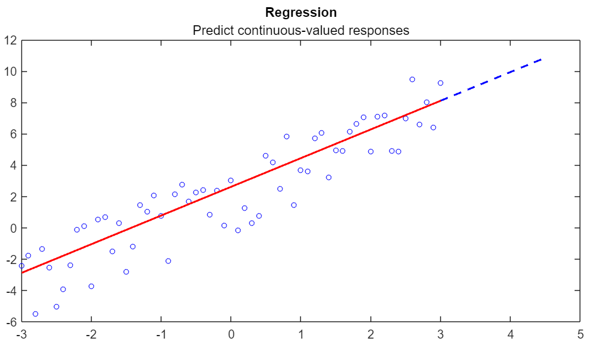
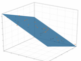

# Machine Learning for Regression

 or 

**Curriculum Module**

_Created with R2024b. Compatible with R2024b and later releases._

# Information

This curriculum module contains interactive [MATLAB® live scripts](https://www.mathworks.com/products/matlab/live-editor.html) that teach the basics of machine learning for regression.

## Background

You can use these live scripts as demonstrations in lectures, class activities, or interactive assignments outside class. This module covers the difference between regression, classification, and clustering, as well as feature engineering and feature extraction, overfitting and underfitting, and a variety of machine learning models commonly used for regression. It also includes a detailed example of applying regression models for electricity load forecasting using real\-world data.

The instructions inside the live scripts will guide you through the exercises and activities. Get started with each live script by running it one section at a time. To stop running the script or a section midway (for example, when an animation is in progress), use the  Stop button in the **RUN** section of the **Live Editor** tab in the MATLAB Toolstrip.

## Contact Us

Contact the [MathWorks Educator Content Development Team](mailto:onlineteaching@mathworks.com) if you would like to provide feedback, or if you have a question.

## Prerequisites

This module does not assume any prior exposure to the subject of machine learning.

## Getting Started
### Accessing the Module
### **On MATLAB Online:**

Use the  link to download the module. You will be prompted to log in or create a MathWorks account. The project will be loaded, and you will see an app with several navigation options to get you started.

### **On Desktop:**

Download or clone this repository. Open MATLAB, navigate to the folder containing these scripts and double\-click on [MLforRegression.prj](MLforRegression.prj). It will add the appropriate files to your MATLAB path and open an app that asks you where you would like to start. 

Ensure you have all the required products (listed below) installed. If you need to include a product, add it using the Add\-On Explorer. To install an add\-on, go to the **Home** tab and select   **Add-Ons** > **Get Add-Ons**. 

## Products

MATLAB® is used throughout. Tools from Statistics and Machine Learning Toolbox™, Deep Learning Toolbox™, and Econometrics Toolbox™ are used frequently as well. Parallel Computing Toolbox™ is utilized specifically for the [parfor](https://www.mathworks.com/help/parallel-computing/parfor.html) function. Curve Fitting Toolbox™ is used specifically for the [fittype](https://www.mathworks.com/help/curvefit/fittype.html) function.

# Scripts

## [**MachineLearningIntro.mlx**](Scripts/MachineLearningIntro.mlx)
|      |      |
| :-- | :-- |
|     | **In this script, students will...**   $\bullet$ Learn the difference between regression, classification, and clustering   $\bullet$ Define feature engineering/extraction   $\bullet$ Identify and use different machine learning models commonly used for regression   $\bullet$ Be able to explain overfitting and underfitting     |
|      |       |

## [**LoadForecastRegression.mlx**](Scripts/LoadForecastRegression.mlx)
|      |      |
| :-- | :-- |
|     | **In this script, students will...**   $\bullet$ Apply the machine learning workflow to solve a problem in time series forecasting   $\bullet$ Engineer appropriate features to solve the forecasting problem   $\bullet$ Validate and compare different types of regression models   $\bullet$ Test and evaluate the trained model to make predictions     |
|      |       |

## [**FE1\_ProgrammaticML.mlx**](Scripts/FE1_ProgrammaticML.mlx) **and** [**FE2\_LoadForecastDL.mlx**](Scripts/FE2_LoadForecastDL.mlx)
|      |      |
| :-- | :-- |
|     | **In these scripts, students will...**   $\bullet$ Expand on the practical problem presented in [LoadForecastRegression.mlx](Scripts/LoadForecastRegression.mlx)   $\bullet$ Define feature engineering/extraction   $\bullet$ Identify and use different machine learning models commonly used for regression   $\bullet$ Be able to explain overfitting and underfitting     |
|      |       |

# Related Courseware Modules
## [**Regression Basics**](https://www.mathworks.com/matlabcentral/fileexchange/93435-regression-basics)
|      |      |
| :-- | :-- |
|     | **Available on:**         [GitHub](https://github.com/MathWorks-Teaching-Resources/Regression-Basics)     |
|      |       |

## [**Machine Learning Methods: Clustering**](https://www.mathworks.com/matlabcentral/fileexchange/135381-machine-learning-methods-clustering)
|      |      |
| :-- | :-- |
|     | **Available on:**         [GitHub](https://github.com/MathWorks-Teaching-Resources/Machine-Learning-Methods-Clustering)     |
|      |       |

Or feel free to explore our other [modular courseware content](https://www.mathworks.com/matlabcentral/fileexchange/?q=tag%3A%22courseware+module%22&sort=downloads_desc_30d).

# Educator Resources
-  [Educator Page](https://www.mathworks.com/academia/educators.html) 

# Contribute 

Looking for more? Find an issue? Have a suggestion? Please contact the [MathWorks Educator Content Development Team](mailto:%20onlineteaching@mathworks.com). If you want to contribute directly to this project, you can find information about how to do so in the [CONTRIBUTING.md](https://github.com/MathWorks-Teaching-Resources/Machine-Learning-for-Regression/blob/release/CONTRIBUTING.md) page on GitHub.

 *©* Copyright 2025 The MathWorks, Inc

